# NimbusFS

[CI](https://github.com/Sameetpatro/NimbusFS/actions/workflows/ci.yml)

**A distributed file storage system I built in Go to understand how systems like GFS and HDFS actually work, not from a textbook diagram, but by writing one.**

NimbusFS takes a file, splits it into chunks, replicates each chunk across multiple storage nodes, and keeps serving downloads even when nodes die. There is a central master for metadata, stateless-ish storage workers, gRPC for node-to-node transfer, and a REST API + CLI on top so you can actually use it.

This started as a learning project that got serious: I wanted to touch replication, placement, heartbeats, crash recovery, observability, and production concerns like TLS and graceful shutdown — all in one cohesive codebase.

---

## Table of contents

- [The idea](#the-idea)
- [What I built](#what-i-built)
- [System architecture](#system-architecture)
- [How a file is stored](#how-a-file-is-stored)
- [Upload flow](#upload-flow)
- [Download flow](#download-flow)
- [When a node dies](#when-a-node-dies)
- [Consistency model](#consistency-model)
- [My implementation choices](#my-implementation-choices)
- [Project structure](#project-structure)
- [Observability](#observability)
- [Security](#security)
- [Quick start](#quick-start)
- [Development](#development)
- [Further reading](#further-reading)

---

## The idea

Big files do not belong on a single disk. Production systems shard them into fixed-size **chunks**, store multiple **replicas** of each chunk on different machines, and keep a **metadata catalog** that maps `file → [chunk₁, chunk₂, …] → [node A, node B, node C]`.

That is the core idea behind Google's GFS and the Hadoop ecosystem's HDFS. I wanted to implement that pattern myself:

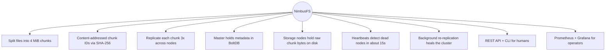


The name **NimbusFS** is a nod to "cloud storage" — nimbus being a cloud — without pretending this is production infrastructure at Google scale. It is a real, runnable system you can demo in Docker in a few minutes.

---

## What I built


| Component              | Role                                                                                    |
| ---------------------- | --------------------------------------------------------------------------------------- |
| **Master**             | REST API, BoltDB metadata, node registry, chunk placement, re-replication orchestration |
| **Storage nodes (×5)** | gRPC servers that store chunks on disk with atomic writes                               |
| **Client (`dfs`)**     | Cobra CLI for upload, download, list, delete, cluster status                            |
| **Prometheus**         | Scrapes `dfs_*` metrics from master and nodes                                           |
| **Grafana**            | Pre-built dashboard for uploads, node health, replication lag                           |


Eight Docker services spin up together. You upload a 10 MB file, kill a storage node, and download the same file again — it still works, served from surviving replicas.

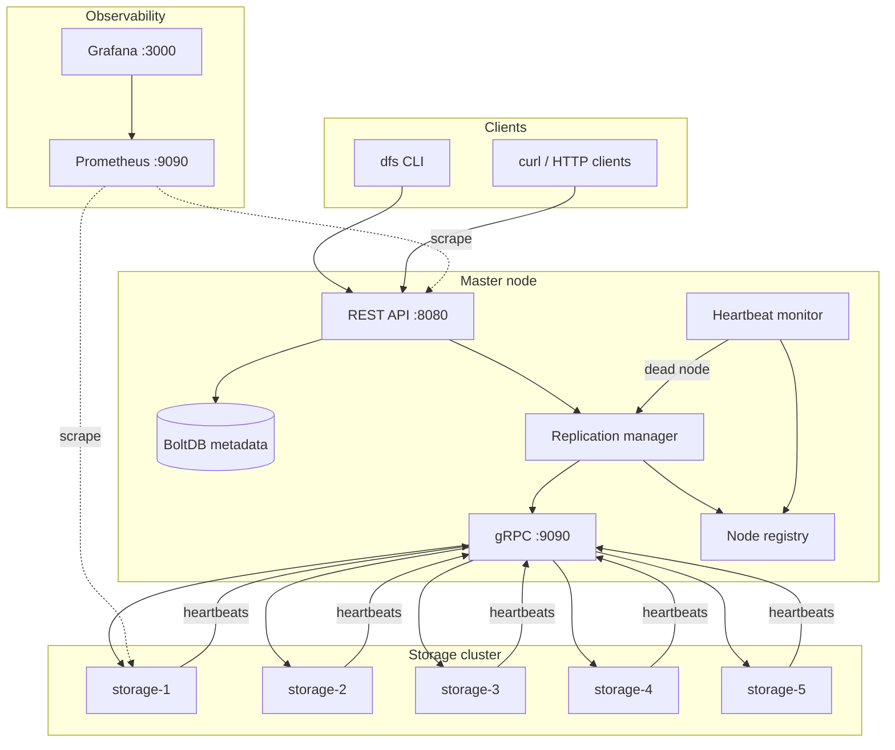


---

## System architecture

At a high level, clients only talk to the master over HTTP. The master talks to storage nodes over gRPC. Storage nodes never talk to each other directly for client uploads — the master fans out replica writes in parallel.

```
                         ┌──────────────────┐
                         │     Client       │
                         │  (dfs CLI / curl)│
                         └────────┬─────────┘
                                  │ HTTP :8080
                                  ▼
┌──────────────────┐    gRPC :9090    ┌───────────────────────────┐
│   Prometheus     │◄─── scrape ─────│         Master            │
│     :9090        │                   │  REST API + BoltDB meta   │
└────────┬─────────┘                   │  Node registry + placement│
         │                             └─────┬──────┬──────┬───────┘
         │ metrics                           │      │      │
         ▼                                   │ gRPC │ gRPC │ gRPC
┌──────────────────┐                         ▼      ▼      ▼
│    Grafana       │                   ┌─────┐ ┌─────┐ ┌─────┐  … ×5
│     :3000        │                   │ S-1 │ │ S-2 │ │ S-3 │
└──────────────────┘                   └─────┘ └─────┘ └─────┘
                                             ╲    │    ╱
                                              chunk replicas (RF=3)
```

### Separation of concerns

I deliberately split **metadata** (what exists, where it lives) from **data** (the actual bytes):

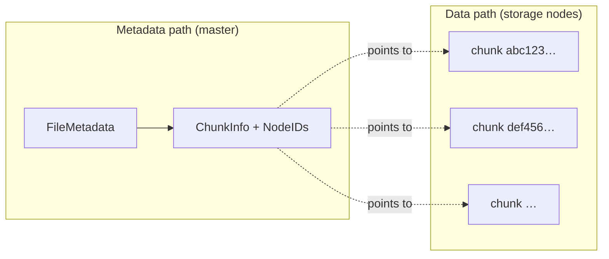


The master never stores file bytes long-term. It streams them through a chunker, pushes replicas to nodes, and persists only the catalog. That keeps the master memory-bounded regardless of file size.

---

## How a file is stored

A 10 MB file with a 4 MiB chunk size becomes three chunks. Each chunk is identified by the SHA-256 hash of its content (content-addressed). Each chunk is copied to three different storage nodes.

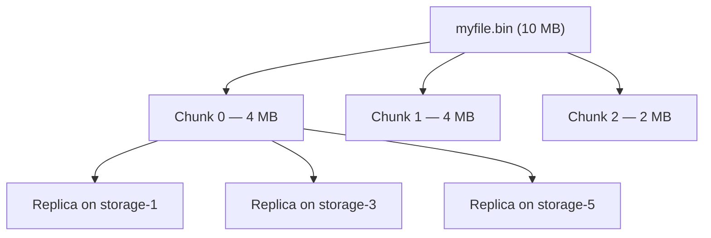


Metadata in BoltDB looks conceptually like this:

```
FileMetadata {
  file_id:   "uuid-…"
  file_name: "myfile.bin"
  size:      10485760
  chunks: [
    { chunk_id: "sha256…", index: 0, node_ids: ["storage-1", "storage-3", "storage-5"] },
    { chunk_id: "sha256…", index: 1, node_ids: ["storage-2", "storage-4", "storage-1"] },
    { chunk_id: "sha256…", index: 2, node_ids: ["storage-3", "storage-5", "storage-2"] },
  ]
}
```

Node selection is **free-space aware**: alive nodes are sorted by available disk, the top N are picked, then shuffled so one node does not absorb every upload.

---

## Upload flow

When you run `dfs upload bigfile.zip` or `curl -F file=@bigfile.zip …/upload`, this is what happens inside the system:

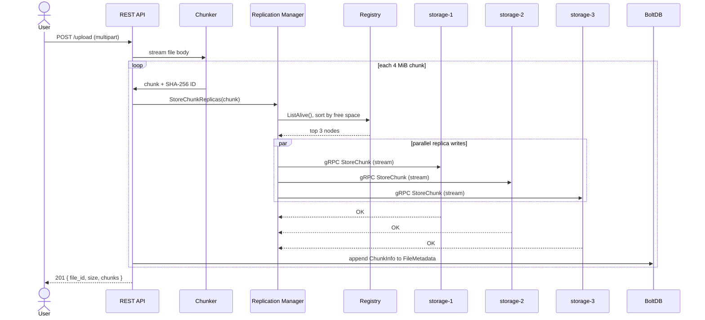


Key implementation details I cared about:

- **Streaming, not buffering** — the chunker reads from `io.Reader` and yields chunks over a channel. A 1 GB upload does not load 1 GB into master RAM.
- **Parallel replication** — `errgroup` writes to all replicas concurrently; first error cancels the rest.
- **Atomic disk writes** — storage nodes write to `chunkID.tmp` then `rename()` to the final path, so a crash mid-write never leaves a half chunk.

---

## Download flow

Downloads reverse the process: load metadata, fetch each chunk in order from any healthy replica, verify checksum, stream bytes to the client.

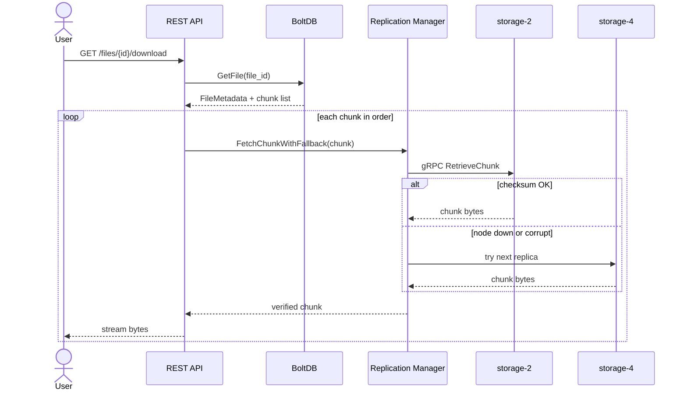


If the first replica in `node_ids` is dead, the system walks the list until one responds. Checksum mismatch triggers the same fallback — corrupted data is never silently returned.

---

## When a node dies

This is the part I was most interested in getting right. Storage nodes send heartbeats every 5 seconds. If the master hears nothing for 15 seconds, the node is marked **dead** and re-replication kicks in.

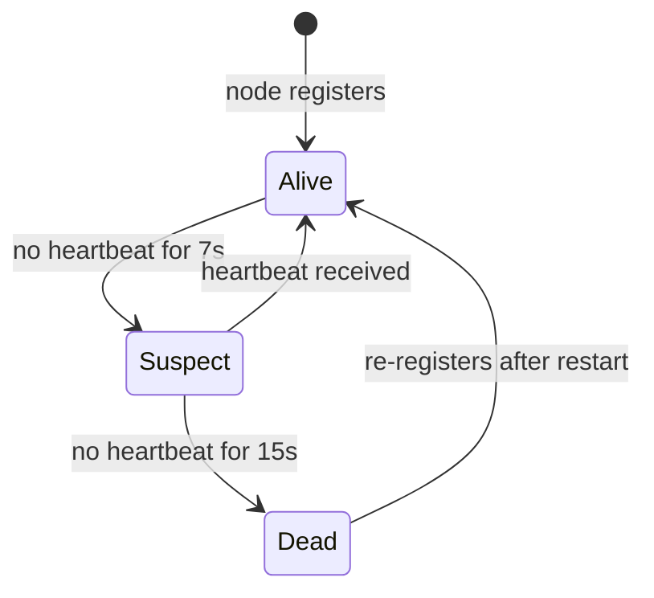


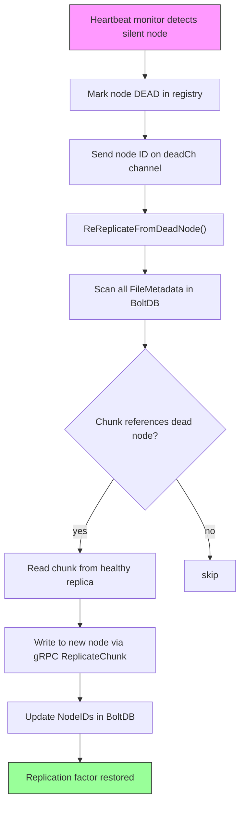


During re-replication, **downloads still work** — surviving replicas serve reads. The cluster heals in the background without blocking clients.

The included `scripts/demo.sh` exercises exactly this: upload a file, `docker stop dfs-storage-3`, wait, download again, `diff` passes.

---

## Consistency model

I made an explicit design choice here rather than hand-waving "distributed systems are hard":

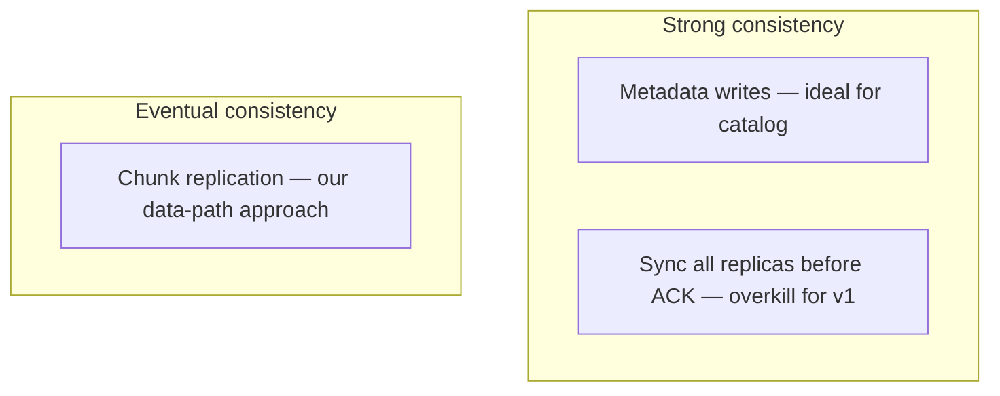


| Layer                           | Model                | Why                                                                                                                                                       |
| ------------------------------- | -------------------- | --------------------------------------------------------------------------------------------------------------------------------------------------------- |
| **Metadata** (BoltDB on master) | Strong consistency   | File listings and chunk locations must be correct or downloads fail unpredictably. BoltDB serializes writes in a single process.                          |
| **Chunk replication**           | Eventual consistency | Waiting for every replica before ACK adds latency tied to the slowest node. I ACK after 3 successful replicas; background heal catches up after failures. |


Full write-up: [docs/consistency.md](docs/consistency.md)

---

## My implementation choices

These are the decisions I made and why — the kind of thing I'd walk through in a system design interview.

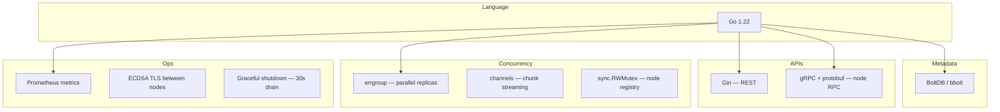


| Decision       | What I chose                                | Why                                                                      |
| -------------- | ------------------------------------------- | ------------------------------------------------------------------------ |
| Language       | Go                                          | Goroutines, `io.Reader` composition, great gRPC/protobuf ecosystem       |
| Metadata store | BoltDB                                      | Embedded, no external DB to operate; crash-safe; fits key-value access   |
| HTTP framework | Gin                                         | Middleware for auth, rate limits, CORS; multipart uploads out of the box |
| Inter-node RPC | gRPC streaming                              | Typed contracts; stream chunks without loading into memory               |
| Chunk identity | SHA-256 content hash                        | Deduplication-ready; built-in integrity check on read                    |
| Placement      | Free-space sort + shuffle                   | Avoid hotspots on the emptiest node                                      |
| TLS            | Self-signed ECDSA P-256                     | Zero-config in Docker via `LoadOrGenerateTLS`; fast handshakes           |
| Logging        | `slog` structured logs                      | Component + node_id fields for grep-friendly ops                         |
| Shutdown       | SIGTERM → HTTP drain → gRPC stop → DB close | Avoids torn requests; BoltDB is crash-safe but close is cleaner          |


---

## Project structure

The codebase is organized so each package has one job:

```
distributed-storage/
├── cmd/
│   ├── master/          # REST + gRPC master process
│   ├── storage/         # storage node process
│   └── client/          # dfs CLI (cobra)
├── internal/
│   ├── api/             # REST handlers, upload/download pipeline
│   ├── metadata/        # BoltDB MetadataStore
│   ├── replication/     # placement, fetch fallback, re-replication
│   ├── heartbeat/       # monitor + sender
│   ├── grpcserver/      # master/storage gRPC + client pool
│   ├── chunking/        # split, stream, checksum
│   ├── registry/        # in-memory node registry
│   ├── tlsconfig/       # dev TLS cert generation
│   └── observability/   # Prometheus metrics
├── proto/               # storage.proto, master.proto
├── deployments/         # Docker, Prometheus, Grafana
├── tests/
│   ├── unit/            # chunker, placement, heartbeat, metadata, …
│   ├── integration/     # in-process cluster, recovery tests
│   └── load/            # k6 load test script
├── scripts/demo.sh      # end-to-end recruiter demo
└── docs/                # architecture, API, deployment guides
```

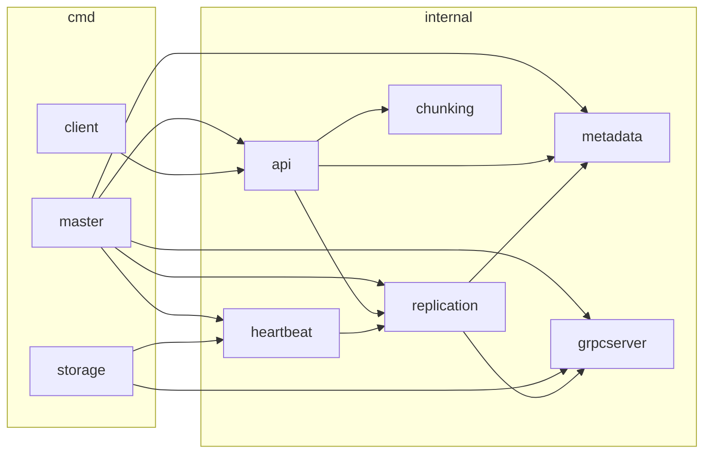


---

## Observability

I wanted to *see* the system working, not just assume it works. Every service exposes Prometheus metrics; Grafana ships with a dashboard.

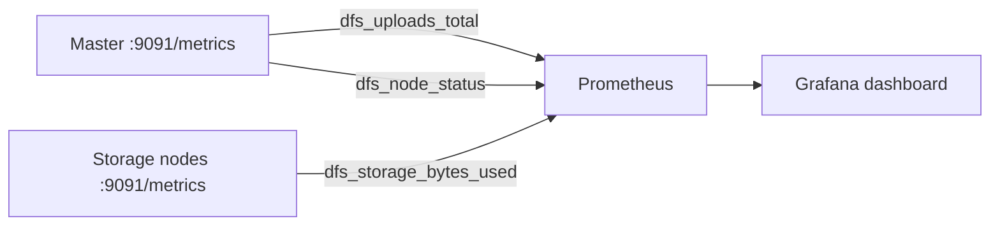


Useful metrics include upload/download counters, per-node alive/dead status, disk usage, and replication lag after a node death.

---

## Security

For a learning project that still demos like production:

- **API auth** — API keys (`X-API-Key`) or JWT bearer tokens
- **Rate limiting** — per-IP token bucket on REST endpoints
- **TLS** — optional (on by default in Docker) for gRPC between master and storage nodes
- **Security headers** — CORS, body size limits, standard HTTP hardening middleware

---

## Quick start

**Prerequisites:** Docker, Docker Compose, `make`, `jq` (for the demo script)

```bash
git clone https://github.com/Sameetpatro/NimbusFS.git
cd NimbusFS/distributed-storage

make docker-up          # builds and starts all 8 services
./scripts/demo.sh       # upload → download → kill node → download again
```

### CLI

```bash
make build
./bin/dfs login --key demo-key
./bin/dfs upload ./myfile.bin
./bin/dfs list
./bin/dfs download <file-id> -o ./out.bin
./bin/dfs status
```

### curl

```bash
# Upload
curl -X POST http://localhost:8080/api/v1/upload \
  -H "X-API-Key: demo-key" \
  -F "file=@myfile.bin"

# Download
curl http://localhost:8080/api/v1/files/<FILE_ID>/download \
  -H "X-API-Key: demo-key" -o out.bin

# Cluster health
curl http://localhost:8080/api/v1/cluster/status | jq .
```

### Service ports


| Service      | Port  | Purpose                  |
| ------------ | ----- | ------------------------ |
| master       | 8080  | REST API                 |
| master       | 9090  | gRPC (storage nodes)     |
| master       | 9091  | Prometheus metrics       |
| storage-1..5 | 9091+ | gRPC + metrics per node  |
| prometheus   | 9090  | Metrics UI               |
| grafana      | 3000  | Dashboards (admin/admin) |


---

## Development

```bash
make proto              # regenerate gRPC code from .proto files
make build              # build master, storage, client binaries
make test-unit          # unit tests
make test-integration   # in-process cluster tests
make test-race          # race detector
make test-cover         # coverage report for internal/
make vet
make lint
```

Load test with [k6](https://k6.io/):

```bash
k6 run tests/load/script.js
```

Configuration lives in `configs/config.yaml`. Override anything via env vars (`MASTER_*`, `NODE_ID`, `TLS_ENABLED`, `AUTH_API_KEYS`, etc.). See [docs/deployment.md](docs/deployment.md) for the full reference.

---

## Further reading


| Document                                         | What's inside                              |
| ------------------------------------------------ | ------------------------------------------ |
| [docs/architecture.md](docs/architecture.md)     | Deeper design notes and data flows         |
| [docs/api.md](docs/api.md)                       | Full REST API reference with curl examples |
| [docs/deployment.md](docs/deployment.md)         | Docker, TLS, scaling nodes, BoltDB backup  |
| [docs/consistency.md](docs/consistency.md)       | Consistency model and tradeoffs            |
| [docs/resume-bullets.md](docs/resume-bullets.md) | Resume-ready project bullets               |


---

## What I'd do next

Honest backlog if I kept going:

- Multi-master metadata (Raft/etcd) to remove the single master SPOF
- Erasure coding instead of full replication for storage efficiency
- Client-side direct-to-storage reads (GFS-style) to reduce master bandwidth
- S3-compatible API layer on top of the same chunk engine

---

## License

MIT